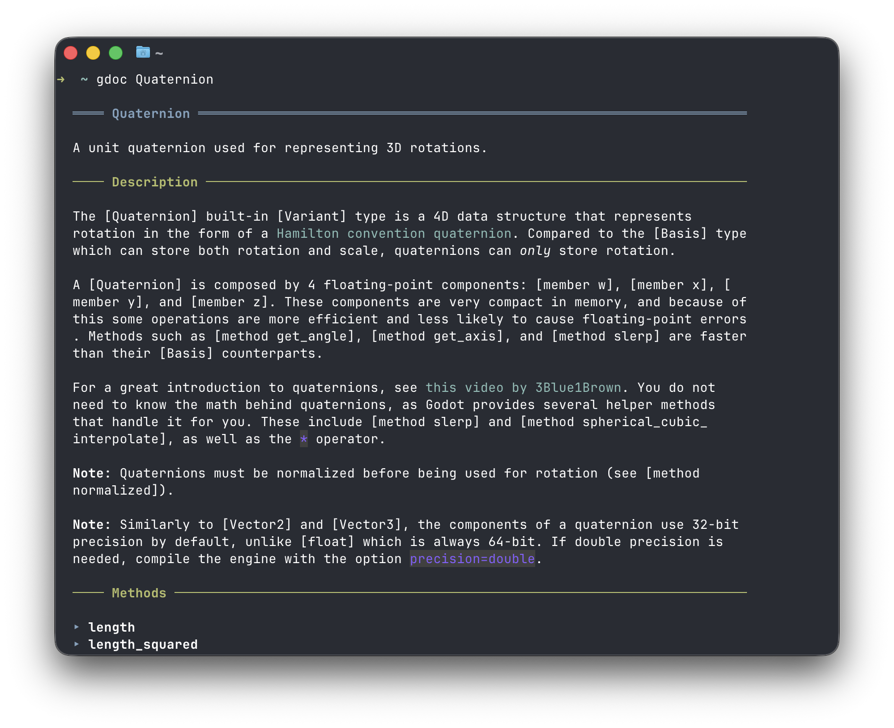

# gdoc

**Pronounced**: *guh-doc*

> Fast, offline Godot API documentation in your terminal



**gdoc** is a command-line documentation viewer for Godot Engine. Instantly look up classes, methods, and properties without leaving your terminal or opening a browser.

Perfect for terminal-first workflows and quick API reference checks while coding.

## Why gdoc?

- **Instant lookup** - Faster than switching to a browser or searching online docs
- **Offline-first** - Uses your local Godot installation, works without internet
- **Readable output** - Converts Godot's BBCode docs to clean, formatted Markdown in your terminal

## Installation

### Pre-built Binaries

Download the latest release for your platform from the [releases page](https://github.com/gdzig/gdoc/releases):

- **macOS**: `gdoc-macos-aarch64` or `gdoc-macos-x86_64`
- **Linux**: `gdoc-linux-x86_64` or `gdoc-linux-aarch64`
- **Windows**: `gdoc-windows-x86_64` or `gdoc-windows-aarch64`

#### Mac/Linux

Extract the archive and move the `gdoc` binary somewhere in your PATH, like `~/.local/bin`.

#### Windows

Install using [Scoop](https://scoop.sh) (coming soon):

```powershell
scoop install gdoc
```

### Build from Source

Requires [Zig 0.15.2](https://ziglang.org/download/):

```bash
git clone https://github.com/gdzig/gdoc.git
cd gdoc
zig build install --release=safe --prefix ~/.local
```

**Requirements**: You'll need `godot` available in your PATH for gdoc to work.

## Quick Start

Look up any Godot class, method, or property:

```bash
gdoc Quaternion
```

This shows the class documentation with all its methods and properties. You can even click external links to open them in your default browser.

### What You Can Look Up

- **Classes**: `gdoc Node2D`
- **Properties**: `gdoc Node2D.position`
- **Methods**: `gdoc String.format`

> **Note**: gdoc is in early alpha. Not all API elements are exposed yet, and search functionality is coming in a future release. For now, you'll need to know the exact symbol name.

### How It Works

When you run gdoc, it calls your local `godot --dump-extension-api-with-docs` to get the latest API documentation. The API is cached after the first run for speed.

If you upgrade Godot or need to regenerate the cache:

```bash
gdoc --clear-cache
```

This ensures you always see docs that match your installed Godot version—no version mismatches or outdated web docs.

## Project Status

gdoc is in **early alpha**. It works for looking up classes, methods, and properties, but expect rough edges and breaking changes as development continues.

### Planned Features

- Search functionality for discovering symbols
- Support for all API elements (signals, enums, constants, annotations)
- Improved output formatting and customization
- Better error messages and suggestions

## Contributing

Contributions are welcome! Please see [CONTRIBUTING.md](CONTRIBUTING.md) for development setup, coding standards, and how to submit pull requests.

## License

[MIT License](LICENSE) - see LICENSE file for details.
